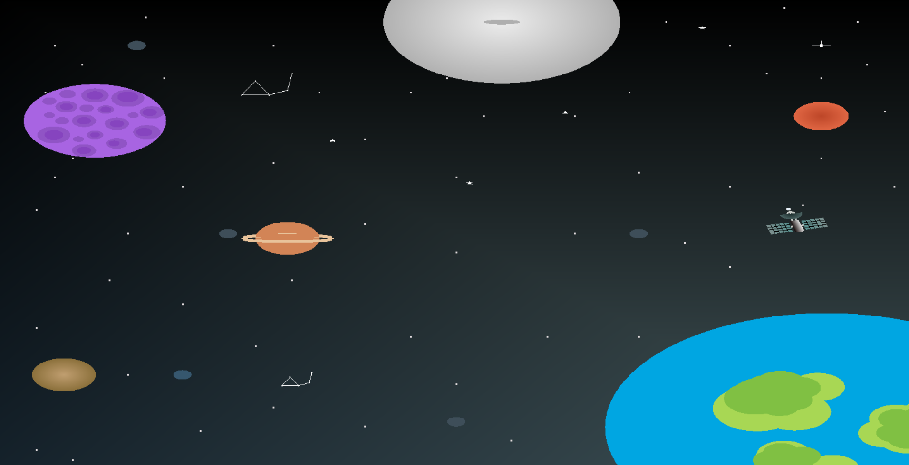

# 🌌 GalaxyView

**GalaxyView** is a C++ application project built using [Code::Blocks](http://www.codeblocks.org/) and compiled with the GCC toolchain. The project supports both **Debug** and **Release** build configurations, making it suitable for development and production-level deployment.

---
<h2>🌌 Preview</h2>
<p>Here’s a screenshot of the GalaxyView application:</p>



## 📁 Project Structure

GalaxyView/
├── GalaxyView.cbp # Code::Blocks project file
├── src/ # (Expected) Source code directory
├── bin/
│ ├── Debug/ # Output for debug build
│ └── Release/ # Output for release build
└── obj/
├── Debug/ # Object files for debug
└── Release/ # Object files for release


> ⚠️ Note: Please ensure you have a `src/` folder containing your `.cpp` files, as this README assumes a typical layout.

---

## 🧰 Requirements

- **Code::Blocks IDE** (with MinGW or other GCC setup)
- **GCC Compiler** (C++17 or newer recommended)
- Optional: Make, CMake, or other build automation tools

---

## ⚙️ Build Instructions

### 🛠️ Using Code::Blocks

1. Open the project file `GalaxyView.cbp` in Code::Blocks.
2. Select the desired build configuration: `Debug` or `Release`.
3. Build the project:
   - Press **F9** or go to **Build > Build and Run**.

### 🖥️ Command-Line (Manual Build)

Ensure your terminal is in the project root and `src/` contains all `.cpp` files.

```bash
# Debug build
g++ -g -o bin/Debug/GalaxyView src/*.cpp

# Release build
g++ -O2 -s -o bin/Release/GalaxyView src/*.cpp
